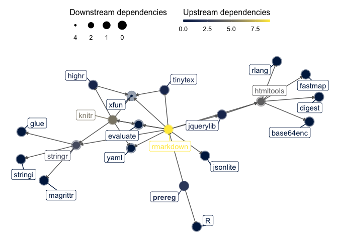

prereg: R Markdown Templates for Preregistrations of Scientific Studies
================

[](https://cran.r-project.org/package=prereg)
[](https://cran.r-project.org/package=prereg)
[](https://www.repostatus.org)


[](https://github.com/crsh/prereg/issues?q=is%3Aopen+is%3Aissue+label%3Abug)

**prereg** provides [R Markdown](https://rmarkdown.rstudio.com/)
templates that facilitates authoring preregistrations of scientific
studies in PDF format.

If you experience any problems or have suggestions for improvements,
please [open an issue](https://github.com/crsh/prereg/issues).

## Setup

### Software requirements

**prereg** depends on additional software, namely,

1.  [R](http://www.r-project.org/) 2.11.1 or later and
2.  [pandoc](http://johnmacfarlane.net/pandoc/) 1.19 or later
3.  [TeX](http://de.wikipedia.org/wiki/TeX) 2013 or later.

If you work with [RStudio](http://www.rstudio.com/) (1.1.453 or later)
pandoc should already be installed, otherwise refer to the [installation
instructions](http://pandoc.org/installing.html) for your operating
system.

#### Setting up a TeX distribution

**prereg** can be used with common TeX distributions, such as
[MikTeX](http://miktex.org/) on Windows,
[MacTeX](https://tug.org/mactex/) on Mac, or [TeX
Live](http://www.tug.org/texlive/) on Linux.

If you mainly use TeX to render R Markdown documents, we strongly
recommend using the [TinyTex](https://yihui.name/tinytex/) distribution.
It is lightweight and automatically installs missing LaTeX packages.
TinyTex can be installed from within R as follows.

``` r
if(!"tinytex" %in% rownames(installed.packages())) install.packages("tinytex")

tinytex::install_tinytex()
```

#### Install prereg

You can install the stable version of **prereg** from CRAN

``` r
install.packages("prereg")
```

or the development version from this GitHub repository (you may have to
install the **remotes** package first).

``` r
if(!"remotes" %in% rownames(installed.packages())) install.packages("remotes")
remotes::install_github("crsh/prereg")
```

### Create a preregistration document

Once you have installed the **prereg** you can select the templates when
creating a new R Markdown file through the RStudio menus.


#### Example

**prereg** produces a clean form-like document.

 

The template file contains comments that provide further details on how
to fill in the form but are invisible in the final PDF document.


#### Using prereg without RStudio

If you want to use **prereg** without RStudio you can use the
`rmarkdown::render` function to create preregistration documents:

``` r
# Create new COS preregistration challenge R Markdown file
rmarkdown::draft(
  "my_preregistration.Rmd"
  , "cos_prereg"
  , package = "prereg"
  , create_dir = FALSE
  , edit = FALSE
)

# Render document
rmarkdown::render("my_preregistration.Rmd")
```

## Uploading your preregistration

After knitting your preregistration to a PDF file using this package,
you may upload this protocol to a trustworthy repository to complete
your preregistration. Possible repositories for this are:

-   [Preregistration in Psychology](https://prereg-psych.org/): A
    preregistration platform provided by the Leibniz Institute for
    Psychology (ZPID) which focuses on psychological research
-   [Open Science Framework](https://osf.io/prereg/): An
    interdisciplinary platform provided by the Center for Open Science
    where preregistrations as well as other materials and data can be
    uploaded

## Package dependencies

<!-- -->

# Acknowledgments

The preregistration templates collected in this package were developed
by others (cited below and in the template documentation). We are
grateful for their permission to use their material in this package.

Bosnjak, M., Fiebach, C. J., Mellor, D., Mueller, S., O’Connor, D. B.,
Oswald, F. L., & Sokol-Chang, R. I. (2021). A template for
preregistration of quantitative research in psychology: Report of the
joint psychological societies preregistration task force. *American
Psychologist*. <http://dx.doi.org/10.1037/amp0000879>

Brandt, M. J., IJzerman, H., Dijksterhuis, A., Farach, F. J., Geller,
J., Giner-Sorolla, R., … van ’t Veer, A. (2014). The Replication Recipe:
What makes for a convincing replication? *Journal of Experimental Social
Psychology*, 50, 217–224. <https://doi.org/10.1016/j.jesp.2013.10.005>

Crüwell, S. & Evans, N. J. (2021). Preregistration in diverse contexts:
a preregistration template for the application of cognitive models.
*Royal Society Open Science*. 8:210155
<https://doi.org/10.1016/j.jesp.2013.10.005>

Flannery, J. E. (2020, October 22). fMRI Preregistration Template.
Retrieved from <https://osf.io/6juft>

van ’t Veer, A. E., & Giner-Sorolla, R. (2016). Pre-registration in
social psychology—A discussion and suggested template. *Journal of
Experimental Social Psychology*, 67, 2–12.
<https://doi.org/10.1016/j.jesp.2016.03.004>
