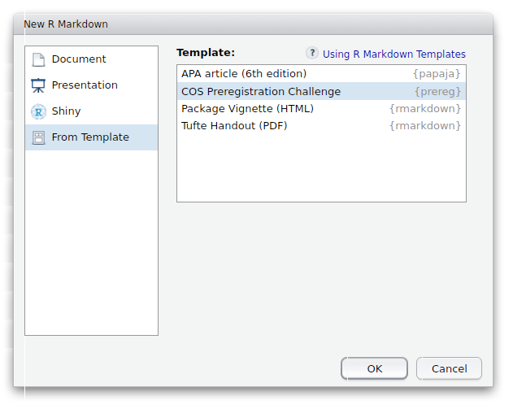
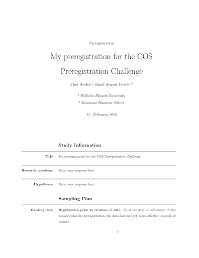
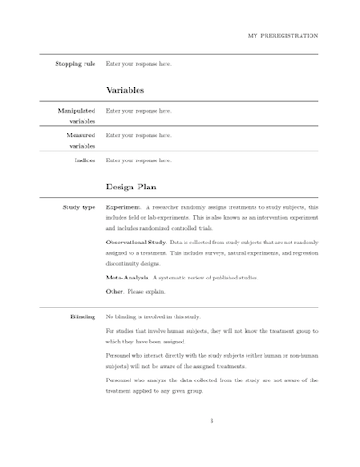
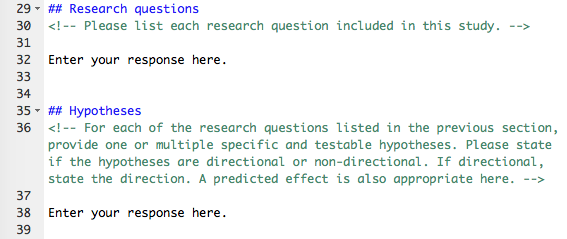
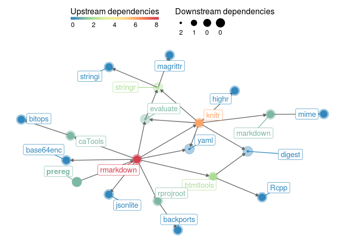

prereg: R Markdown Templates for Preregistrations of Scientific Studies
================

[](https://cran.r-project.org/package=prereg) [](https://cran.r-project.org/package=prereg) [](http://www.repostatus.org/#active) [](https://travis-ci.org/crsh/prereg)

`prereg` provides [R Markdown](http://rmarkdown.rstudio.com/) templates that facilitates authoring preregistrations of scientific studies in PDF format. The templates are based on the [Center for Open Science Preregistration Challenge](https://cos.io/prereg/), the [AsPredicted.org](http://aspredicted.org) questions, a template suggested for social psychology by van 't Veer and Giner-Sorolla (2016), and the replication recipe suggested by Brandt et al. (2013).

If you experience any problems or have suggestions for improvements, please [open an issue](https://github.com/crsh/prereg/issues).

Setup
-----

### Requirements

To use R Markdown and `prereg` you need the following software on your computer:

-   [R](http://www.r-project.org/) (2.11.1 or later)
-   [RStudio](http://www.rstudio.com/) (0.99.441 or later) is optional; if you don't use RStudio, you need to install [pandoc](http://johnmacfarlane.net/pandoc/) using the [instructions for your operating system](https://github.com/rstudio/rmarkdown/blob/master/PANDOC.md)
-   A [TeX](http://de.wikipedia.org/wiki/TeX) distribution (2013 or later; e.g., [MikTeX](http://miktex.org/) for Windows, [MacTeX](https://tug.org/mactex/) for Mac, obviously, or [TeX Live](http://www.tug.org/texlive/) for Linux)
-   If you are running **Windows**, use MikTex if possible. Currently, pandoc and the Windows version of Tex Live [don't seem to like each other](https://github.com/rstudio/rmarkdown/issues/6). Make sure you install the *complete*---not the basic---version.

### Install prereg

You can install the stable version of `prereg` from CRAN

``` r
install.packages("prereg")
```

or the development version from this GitHub repository (you may have to install the `devtools` package first).

``` r
install.packages("devtools")
devtools::install_github("crsh/prereg")
```

### Create a preregistration document

Once you have installed the `prereg` you can select the templates when creating a new R Markdown file through the RStudio menus.



#### Example

`prereg` produces a clean form-like document.

 

The template file contains comments that provide further details on how to fill in the form but are invisible in the final PDF document.



#### Using prereg without RStudio

If you want to use `prereg` without RStudio you can use the `rmarkdown::render` function to create preregistration documents:

``` r
# Create new COS preregistration challenge R Markdown file
rmarkdown::draft(
  "my_preregistration.Rmd"
  , "cos_prereg"
  , package = "prereg"
  , create_dir = FALSE
  , edit = FALSE
)

# Render document
rmarkdown::render("my_preregistration.Rmd")
```

Acknowledgements
----------------

The templates for the preregistrations were developed by the [Center for Open Science](https://cos.io/prereg/), [AsPredicted.org](http://aspredicted.org), and Anna Elisabeth van 't Veer and Roger Giner-Sorolla, respectively. I'm thankful for their permission to use their material in this package.

Package dependencies
--------------------



References
==========

Brandt, M. J., IJzerman, H., Dijksterhuis, A., Farach, F. J., Geller, J., Giner-Sorolla, R., ... van 't Veer, A. (2014). The Replication Recipe: What makes for a convincing replication? *Journal of Experimental Social Psychology*, 50, 217--224. doi: [10.1016/j.jesp.2013.10.005](https://doi.org/10.1016/j.jesp.2013.10.005)

van 't Veer, A. E., & Giner-Sorolla, R. (2016). Pre-registration in social psychology---A discussion and suggested template. *Journal of Experimental Social Psychology*, 67, 2--12. doi: [10.1016/j.jesp.2016.03.004](http://dx.doi.org/10.1016/j.jesp.2016.03.004)
